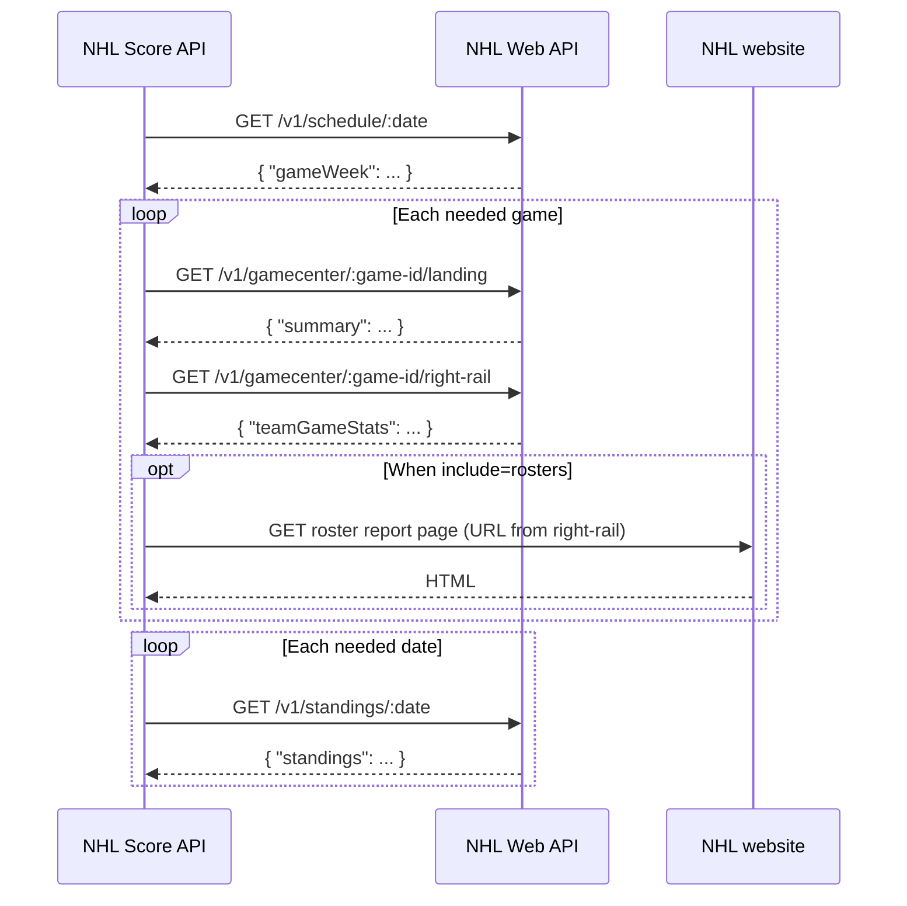

# NHL Score API

A JSON API that returns the scores and goals from the latest finished or on-going NHL games. The API is available at
https://nhl-score-api.herokuapp.com/, and it serves as the backend for [nhl-recap](https://github.com/peruukki/nhl-recap).

The data source responses are cached in-memory for one minute, and then refreshed upon the next request. This means in practice:

- the data for a particular request usually refreshes once a minute at best
- there can be quite a bit of variance in response times

## Data source

The data is sourced from the same NHL Web API at https://api-web.nhle.com that the NHL website uses. The NHL Web API is
undocumented but unofficial documentation exists:

- https://github.com/Zmalski/NHL-API-Reference: fairly recent, seems very comprehensive and updated lately
- https://gitlab.com/dword4/nhlapi: older, plenty of discussion in its [issues](https://gitlab.com/dword4/nhlapi/-/issues)
  (thoughly mainly on the previous NHL Web API version)

How we use the NHL Web API:

- [schedule](https://api-web.nhle.com/v1/schedule/2023-11-07) gives us a list of the week’s games; we check the game
  statuses and get the game IDs to fetch the games’ gamecenter landing page and right-rail data
- [landing](https://api-web.nhle.com/v1/gamecenter/2023020180/landing) gives us basic details of an individual game
- [right-rail](https://api-web.nhle.com/v1/gamecenter/2023020180/right-rail) gives us more details of an individual game,
  like game stats and recap video links
- [standings](https://api-web.nhle.com/v1/standings/2023-11-07) gives us team stats

<details>
<summary>
Data fetching sequence diagram
</summary>



</details>

## API

### Scores from latest finished NHL games

#### `GET` [/api/scores/latest](https://nhl-score-api.herokuapp.com/api/scores/latest)

Returns an object with the date and the scores from the latest round’s games.

**Optional query parameter:** Use `include=rosters` to include roster data (dressed and scratched players) for each started game when available.

The `date` object contains the date in a raw format and a prettier, displayable format, or
`null` if there are no scores.

The `games` array contains details of the games, each game item containing these fields:

- `status` _(object)_
- `startTime` _(string)_
- `goals` _(array)_
- `scores` _(object)_
- `teams` _(object)_
- `gameStats` _(object)_
- `preGameStats` _(object)_
- `currentStats` _(object)_
- `links` _(object)_
- `rosters` _(object)_ (only present when requested with `include=rosters` and roster data is available for the game)
- `errors` _(array)_ (only present if data validity errors were detected)

The fields are described in more detail in [Response fields](#response-fields).

### Scores / game previews from given date range

#### `GET` [/api/scores?startDate=YYYY-MM-DD&endDate=YYYY-MM-DD](https://nhl-score-api.herokuapp.com/api/scores?startDate=2023-11-12&endDate=2023-11-13)

Returns an array of objects with the date and the scores from given date range’s games.
Both `startDate` and `endDate` are inclusive, and `endDate` is optional. **The range is
limited to a maximum of 7 days** to set some reasonable limit for the (cached) response;
this also matches the NHL Web API that returns one week’s schedule at a time.

**Optional query parameter:** Use `include=rosters` to include roster data (dressed and scratched players) for each started game when available.

The `date` object contains the date in a raw format and a prettier, displayable format. Contrary to the
`/api/scores/latest` endpoint, the `date` is included even if that date has no scheduled games.
Though see the "If a date has no scheduled games" part below for possible peculiarities in that case.

The `games` array contains details of the games, each game item containing these fields:

- `status` _(object)_
- `startTime` _(string)_
- `goals` _(array)_
- `scores` _(object)_
- `teams` _(object)_
- `gameStats` _(object)_
- `preGameStats` _(object)_
- `currentStats` _(object)_
- `links` _(object)_
- `rosters` _(object)_ (only present when requested with `include=rosters` and roster data is available for the game)
- `errors` _(array)_ (only present if data validity errors were detected)

**If a date has no scheduled games**, you will either get:

- no entry for that date in the response, or
- an entry with an empty `games` array

This variety comes directly from the NHL Web API response, I don’t know why it
behaves differently for some date ranges than others. Check the entries’ `date` > `raw`
field to see what dates are actually included.

The fields are described in more detail in [Response fields](#response-fields).

### Response examples

<details>
<summary>
Example of a single regular season date in the API response
</summary>

```json
{
  "date": {
    "raw": "2017-10-16",
    "pretty": "Mon Oct 16"
  },
  "games": [
    {
      "status": {
        "state": "FINAL"
      },
      "startTime": "2016-02-29T00:00:00Z",
      "goals": [
        ...
        {
          "period": "OT",
          "scorer": {
            "player": "David Krejci",
            "playerId": 8471276,
            "seasonTotal": 1
          },
          "assists": [
            {
              "player": "Torey Krug",
              "playerId": 8476792,
              "seasonTotal": 3
            },
            {
              "player": "Zdeno Chara",
              "playerId": 8465009,
              "seasonTotal": 2
            }
          ],
          "team": "BOS",
          "min": 2,
          "sec": 36,
          "strength": "PPG"
        }
      ],
      "scores": {
        "BOS": 4,
        "CHI": 3,
        "overtime": true
      },
      "teams": {
        "away": {
          "abbreviation": "BOS",
          "id": 6,
          "locationName": "Boston",
          "shortName": "Boston",
          "teamName": "Bruins"
        },
        "home": {
          "abbreviation": "CHI",
          "id": 16,
          "locationName": "Chicago",
          "shortName": "Chicago",
          "teamName": "Blackhawks"
        }
      },
      "gameStats": {
        "blocked": {
          "BOS": 8,
          "CHI": 9
        },
        "faceOffWinPercentage": {
          "BOS": "45.5",
          "CHI": "54.5"
        },
        "giveaways": {
          "BOS": 5,
          "CHI": 12
        },
        "hits": {
          "BOS": 22,
          "CHI": 22
        },
        "pim": {
          "BOS": 6,
          "CHI": 4
        },
        "powerPlay": {
          "BOS": {
            "goals": 0,
            "opportunities": 2,
            "percentage": "0.0"
          },
          "CHI": {
            "goals": 1,
            "opportunities": 3,
            "percentage": "33.3"
          }
        },
        "shots": {
          "BOS": 37,
          "CHI": 25
        },
        "takeaways": {
          "BOS": 8,
          "CHI": 9
        }
      },
      "preGameStats": {
        "records": {
          "BOS": {
            "wins": 43,
            "losses": 31,
            "ot": 7
          },
          "CHI": {
            "wins": 50,
            "losses": 22,
            "ot": 9
          }
        },
        "streaks": {
          "BOS": {
            "count": 1,
            "type": "WINS"
          },
          "CHI": {
            "count": 2,
            "type": "LOSSES"
          }
        },
        "standings": {
          "BOS": {
            "conferenceRank": "5",
            "divisionRank": "3",
            "leagueRank": "9",
            "pointsFromPlayoffSpot": "+15"
          },
          "CHI": {
            "conferenceRank": "11",
            "divisionRank": "6",
            "leagueRank": "25",
            "pointsFromPlayoffSpot": "-3"
          }
        }
      },
      "currentStats": {
        "records": {
          "BOS": {
            "wins": 44,
            "losses": 31,
            "ot": 7
          },
          "CHI": {
            "wins": 50,
            "losses": 22,
            "ot": 10
          }
        },
        "streaks": {
          "BOS": {
            "count": 2,
            "type": "WINS"
          },
          "CHI": {
            "count": 1,
            "type": "OT"
          }
        },
        "standings": {
          "BOS": {
            "conferenceRank": "5",
            "divisionRank": "2",
            "leagueRank": "8",
            "pointsFromPlayoffSpot": "+17"
          },
          "CHI": {
            "conferenceRank": "11",
            "divisionRank": "6",
            "leagueRank": "25",
            "pointsFromPlayoffSpot": "-4"
          }
        }
      },
      "links": {
        "gameCenter": "https://www.nhl.com/gamecenter/bos-vs-chi/2023/10/24/2023020092",
        "videoRecap": "https://www.nhl.com/video/recap-bruins-at-blackhawks-10-24-23-6339814966112"
      }
    },
    {
      "status": {
        "state": "LIVE",
        "progress": {
          "currentPeriod": 3,
          "currentPeriodOrdinal": "3rd",
          "currentPeriodTimeRemaining": {
            "pretty": "01:58",
            "min": 1,
            "sec": 58
          }
        }
      },
      "startTime": "2016-02-29T02:30:00Z",
      "goals": [
        ...
        {
          "period": "OT",
          "scorer": {
            "player": "Kyle Turris",
            "playerId": 8474068,
            "seasonTotal": 1
          },
          "assists": [
            {
              "player": "Mika Zibanejad",
              "playerId": 8476459,
              "seasonTotal": 3
            }
          ],
          "team": "OTT",
          "min": 17,
          "sec": 30,
          "emptyNet": true
        }
      ],
      "scores": {
        "OTT": 3,
        "DET": 1
      },
      "teams": {
        "away": {
          "abbreviation": "OTT",
          "id": 9,
          "locationName": "Ottawa",
          "shortName": "Ottawa",
          "teamName": "Senators"
        },
        "home": {
          "abbreviation": "DET",
          "id": 17,
          "locationName": "Detroit",
          "shortName": "Detroit",
          "teamName": "Red Wings"
        }
      },
      "gameStats": {
        "blocked": {
          "OTT": 6,
          "DET": 3
        },
        "faceOffWinPercentage": {
          "OTT": "42.3",
          "DET": "57.7"
        },
        "giveaways": {
          "OTT": 4,
          "DET": 7
        },
        "hits": {
          "OTT": 11,
          "DET": 15
        },
        "pim": {
          "OTT": 2,
          "DET": 4
        },
        "powerPlay": {
          "OTT": {
            "goals": 1,
            "opportunities": 2,
            "percentage": "50.0"
          },
          "DET": {
            "goals": 0,
            "opportunities": 1,
            "percentage": "0.0"
          }
        },
        "shots": {
          "OTT": 19,
          "DET": 24
        },
        "takeaways": {
          "OTT": 4,
          "DET": 7
        }
      },
      "preGameStats": {
        "records": {
          "OTT": {
            "wins": 43,
            "losses": 28,
            "ot": 10
          },
          "DET": {
            "wins": 33,
            "losses": 36,
            "ot": 12
          }
        },
        "streaks": {
          "OTT": {
            "count": 3,
            "type": "LOSSES"
          },
          "DET": {
            "count": 1,
            "type": "WINS"
          }
        },
        "standings": {
          "OTT": {
            "conferenceRank": "15",
            "divisionRank": "8",
            "leagueRank": "29",
            "pointsFromPlayoffSpot": "0"
          },
          "DET": {
            "conferenceRank": "12",
            "divisionRank": "7",
            "leagueRank": "23",
            "pointsFromPlayoffSpot": "+2"
          }
        }
      },
      "currentStats": {
        "records": {
          "OTT": {
            "wins": 43,
            "losses": 28,
            "ot": 10
          },
          "DET": {
            "wins": 33,
            "losses": 36,
            "ot": 12
          }
        },
        "streaks": {
          "OTT": {
            "count": 1,
            "type": "WINS"
          },
          "DET": {
            "count": 1,
            "type": "LOSSES"
          }
        },
        "standings": {
          "OTT": {
            "conferenceRank": "15",
            "divisionRank": "8",
            "leagueRank": "29",
            "pointsFromPlayoffSpot": "+2"
          },
          "DET": {
            "conferenceRank": "12",
            "divisionRank": "7",
            "leagueRank": "23",
            "pointsFromPlayoffSpot": "0"
          }
        }
      },
      "links": {
        "gameCenter": "https://www.nhl.com/gamecenter/ott-vs-det/2023/12/09/2023020412"
      }
    }
  ]
}
```

</details>

<details>
<summary>
Example of a single playoff date in the API response
</summary>

```json
{
  "date": {
    "raw": "2017-10-16",
    "pretty": "Mon Oct 16"
  },
  "games": [
    {
      "status": {
        "state": "PREVIEW"
      },
      "startTime": "2016-02-29T02:30:00Z",
      "goals": [],
      "scores": {
        "NYR": 0,
        "PIT": 0
      },
      "teams": {
        "away": {
          "abbreviation": "NYR",
          "id": 3,
          "locationName": "New York",
          "shortName": "NY Rangers",
          "teamName": "Rangers"
        },
        "home": {
          "abbreviation": "PIT",
          "id": 5,
          "locationName": "Pittsburgh",
          "shortName": "Pittsburgh",
          "teamName": "Penguins"
        }
      },
      "preGameStats": {
        "records": {
          "NYR": {
            "wins": 48,
            "losses": 28,
            "ot": 6
          },
          "PIT": {
            "wins": 50,
            "losses": 21,
            "ot": 11
          }
        },
        "playoffSeries": {
          "round": 0,
          "wins": {
            "NYR": 1,
            "PIT": 1
          }
        }
      },
      "currentStats": {
        "records": {
          "NYR": {
            "wins": 48,
            "losses": 28,
            "ot": 6
          },
          "PIT": {
            "wins": 50,
            "losses": 21,
            "ot": 11
          }
        },
        "playoffSeries": {
          "round": 0,
          "wins": {
            "NYR": 1,
            "PIT": 1
          }
        }
      },
      "links": {}
    }
  ]
}
```

</details>

### Response fields

#### Date fields explained:

- `raw` _(string)_: the raw date in "YYYY-MM-DD" format, usable for any kind of processing
- `pretty` _(string)_: a prettified format, can be shown as-is in the client

#### Game fields explained:

- `status` object: current game status, with the fields:
  - `state` _(string)_:
    - `"CANCELED"` if the game has been canceled
    - `"FINAL"` if the game has ended
    - `"LIVE"` if the game is still in progress
    - `"POSTPONED"` if the game has been postponed
    - `"PREVIEW"` if the game has not started yet
  - `progress` object: game progress, only present if `state` is `"LIVE"`, with the fields:
    - `currentPeriod` _(number)_: current period as a number
    - `currentPeriodOrdinal` _(string)_: current period as a display string (e.g. `"2nd"`)
    - `currentPeriodTimeRemaining` _(object_): time remaining in current period:
      - `pretty` (_string_): time remaining in prettified `mm:ss` format; `"END"` if the current period has ended
      - `min` _(number)_: minutes remaining; `0` if the current period has ended
      - `sec` _(number)_: seconds remaining; `0` if the current period has ended
- `startTime` string: the game start time in standard [ISO 8601](https://en.wikipedia.org/wiki/ISO_8601) format
  "YYYY-MM-DDThh:mm:ssZ"
- `goals` array: list of goal details, in the order the goals were scored
  - gameplay goal:
    - `assists` _(array)_ of objects with the fields (an empty array for unassisted goals):
      - `player` _(string)_: the name of the player credited with the assist
      - `playerId` _(number)_: player ID in NHL APIs (can be used to fetch other resources from NHL APIs)
      - `seasonTotal` _(number)_: the number of assists the player has had this season
    - `emptyNet` _(boolean)_: set to `true` if the goal was scored in an empty net, absent if it wasn’t
    - `min` _(number)_: the goal scoring time minutes, from the start of the period
    - `period` _(string)_: in which period the goal was scored; `"OT"` means **regular season 5 minute overtime**
    - `scorer` _(object)_:
      - `player` _(string)_: the name of the goal scorer
      - `playerId` _(number)_: player ID in NHL APIs (can be used to fetch other resources from NHL APIs)
      - `seasonTotal` _(number)_: the number of goals the player has scored this season
    - `sec` _(number)_: the goal scoring time seconds, from the start of the period
    - `strength` _(string)_: can be set to `"PPG"` (power play goal) or `"SHG"` (short handed goal); absent
      if the goal was scored on even strength
    - `team` _(string)_: the team that scored the goal
  - shootout goal:
    - `period` _(string)_: `"SO"`
    - `scorer` _(object)_:
      - `player` _(string)_: the name of the goal scorer
      - `playerId` _(number)_: player ID in NHL APIs (can be used to fetch other resources from NHL APIs)
    - `team` _(string)_: the team that scored the goal
- `scores` object: each team’s goal count, plus one of these possible fields:
  - `overtime`: set to `true` if the game ended in overtime, absent if it didn’t
  - `shootout`: set to `true` if the game ended in shootout, absent if it didn’t
- `teams` object:
  - `away` _(object)_: away team info:
    - `abbreviation`: team name abbreviation
    - `id`: team ID in NHL APIs (can be used to fetch other resources from NHL APIs)
    - `locationName`: team location name, e.g. `"New York"`
    - `shortName`: team short name, e.g. `"NY Rangers"`
    - `teamName`: team name, e.g. `"Rangers"`
  - `home` _(object)_: home team info:
    - `abbreviation`: team name abbreviation
    - `id`: team ID in NHL APIs (can be used to fetch other resources from NHL APIs)
    - `locationName`: team location name, e.g. `"St. Louis"`
    - `shortName`: team short name, e.g. `"St Louis"` (note: "St" without a period)
    - `teamName`: team name, e.g. `"Blues"`
- `gameStats` object: each team’s game statistics, with the fields (**only included in started games**):
  - `blocked`: blocked shots
  - `faceOffWinPercentage`: what it says
  - `giveaways`: what it says
  - `hits`: what it says
  - `pim`: penalties in minutes
  - `powerPlay` _(object)_:
    - `goals`: number of power play goals
    - `opportunities`: number of power play opportunities
    - `percentage`: power play efficiency, e.g. `50.0`
  - `shots`: shots on goal
  - `takeaways`: what it says
- `preGameStats` object: each team’s season statistics _before the game_, with the fields:
  - `records` object: each team’s record for this **regular season**, with the fields:
    - `wins` _(number)_: win count (earning 2 pts)
    - `losses` _(number)_: regulation loss count (0 pts)
    - `ot` _(number)_: loss count for games that went to overtime (1 pt)
  - `playoffSeries` object: current playoff series related information (only present in playoff games), with the fields:
    - `round` _(number)_: the game’s playoff round; `0` for the Stanley Cup Qualifiers best-of-5 series (in 2020 due to COVID-19), actual playoffs start from `1`
    - `wins` _(object)_: each team’s win count in the series
  - `streaks` object: each team’s current form streak (only present in regular season games), with the fields (**or `null` if the
    team hasn’t played during the season yet**):
    - `type` _(string)_: `"WINS"` (wins in regulation, OT or SO), `"LOSSES"` (losses in regulation) or `"OT"` (losses in OT or SO)
    - `count` _(number)_: streak’s length in consecutive games
  - `standings` object: each team’s standings related information, with the fields:
    - `divisionRank` _(string)_: the team’s regular season ranking in their division (based on point percentage); this comes as a _string_ value from the NHL Web API (**can be an empty string before the season has started**)
    - `conferenceRank` _(string)_: the team’s regular season ranking in their conference (based on point percentage, not considering wildcard seedings);
      this comes as a _string_ value from the NHL Web API (**can be an empty string before the season has started**)
    - `leagueRank` _(string)_: the team’s regular season ranking in the league (based on point percentage); this comes as a _string_ value from the NHL Web API (**can be an empty string before the season has started**)
    - `pointsFromPlayoffSpot` _(string)_: point difference to the last playoff spot in the conference (**can be an empty string before the season has started**)
      - for teams currently in the playoffs, this is the point difference to the first team out of the playoffs;
        i.e. by how many points the team is safe
      - for teams currently outside the playoffs, this is the point difference to the team in the last playoff spot (2nd wildcard
        position); i.e. by how many points (at minimum) the team needs to catch up
      - Note: this value only indicates point differences and doesn’t consider which team is ranked higher if they have the same
        number of points
- `currentStats` object: each team’s current (ie. after the game if it has finished and NHL have updated their stats) season statistics _on the game date_, with the fields:
  - `records` object: each team’s record for this **regular season**, with the fields:
    - `wins` _(number)_: win count (earning 2 pts)
    - `losses` _(number)_: regulation loss count (0 pts)
    - `ot` _(number)_: loss count for games that went to overtime (1 pt)
  - `streaks` object (**or `null` if querying coming season’s games**): each team’s current form streak (only present in regular season games), with the fields:
    - `type` _(string)_: `"WINS"` (wins in regulation, OT or SO), `"LOSSES"` (losses in regulation) or `"OT"` (losses in OT or SO)
    - `count` _(number)_: streak’s length in consecutive games
  - `standings` object (**or `null` if querying coming season’s games**): each team’s standings related information, with the fields:
    - `divisionRank` _(string)_: the team’s regular season ranking in their division (based on point percentage); this comes as a _string_ value from the NHL Web API
    - `conferenceRank` _(string)_: the team’s regular season ranking in their conference (based on point percentage, not considering wildcard seedings);
      this comes as a _string_ value from the NHL Web API
    - `leagueRank` _(string)_: the team’s regular season ranking in the league (based on point percentage); this comes as a _string_ value from the NHL Web API
    - `pointsFromPlayoffSpot` _(string)_: point difference to the last playoff spot in the conference
      - for teams currently in the playoffs, this is the point difference to the first team out of the playoffs;
        i.e. by how many points the team is safe
      - for teams currently outside the playoffs, this is the point difference to the team in the last playoff spot (2nd wildcard
        position); i.e. by how many points (at minimum) the team needs to catch up
      - Note: this value only indicates point differences and doesn’t consider which team is ranked higher if they have the same
        number of points
  - `playoffSeries` object: current playoff series related information (only present in playoff games), with the fields:
    - `round` _(number)_: the game’s playoff round; `0` for the Stanley Cup Qualifiers best-of-5 series (in 2020 due to COVID-19), actual playoffs start from `1`
    - `wins` _(object)_: each team’s win count in the series
- `links` object: links to related pages on the official NHL site, with the optional fields:
  - `gameCenter`: game summary with lots of related info
  - `playoffSeries`: playoff series specific info (only present in playoff games)
  - `videoRecap`: 5-minute video recap (once available)
- `rosters` object: each team’s dressed and scratched players (only present when roster data is available for finished or live games), with the fields:
  - `dressedPlayers` _(array)_: players in the lineup, each item containing:
    - `name` _(string)_
    - `position` _(string)_:
      - `"C"` for center
      - `"D"` for defense
      - `"G"` for goalie
      - `"L"` for left wing
      - `"R"` for right wing
    - `number` _(number)_
    - `startingLineup` _(boolean)_: present and `true` only for players in the starting lineup (for example, the starting goalie)
  - `scratchedPlayers` _(array)_: scratched players, each item containing:
    - `name` _(string)_
    - `position` _(string)_:
      - `"C"` for center
      - `"D"` for defense
      - `"G"` for goalie
      - `"L"` for left wing
      - `"R"` for right wing
    - `number` _(number)
- `errors` array: list of data validation errors, only present if any were detected. Sometimes the NHL Web API temporarily contains
  invalid or missing data. Currently we check if the goal data from the NHL Web API (read from its `scoringPlays` field) contains the
  same number of goals than the score data (read from its `teams` field). If it doesn’t, two different errors can be reported:
  - `{ "error": "MISSING-ALL-GOALS" }`: all goal data is missing; this has happened occasionally
  - `{ "error": "SCORE-AND-GOAL-COUNT-MISMATCH", "details": { "goalCount": 3, "scoreCount": 4 } }`: goal data exists but doesn’t contain
    the same number of goals than the teams’ scores; haven’t noticed this happen but good to check anyway

**Note on overtimes:** Only regular season 5 minute overtimes are considered "overtime" in the
`goals` array. Playoff overtime periods are returned as period 4, 5, and so on, since they are
20 minute periods. However, all games (including playoff games) that went into overtime are
marked as having ended in overtime in the `scores` object.

## Requirements

- Java version 17
- [Leiningen](https://leiningen.org/) is used for project management.
- [Docker](https://www.docker.com/) can be used optionally for running the application locally.

### Setting up the development environment

This project uses [SDKMAN!](https://sdkman.io/) to manage Java and Leiningen versions. A [`.sdkmanrc`](.sdkmanrc)
file in the project root specifies the required versions.

To set up the correct versions:

1. Install [SDKMAN!](https://sdkman.io/install) if you haven't already
2. Navigate to the project directory
3. Run `sdk env` activate the correct versions (you will be prompted to install them if needed)

## Running application

### Using [Docker](https://www.docker.com/)

To run the application locally in [Docker](https://www.docker.com/) containers, install Docker and run:

```sh
./docker-up.sh
```

Downloading the [Clojure](https://hub.docker.com/_/clojure/) image will take quite a while on the first run,
but it will be reused after that.

To delete all containers, run:

```sh
./docker-down.sh
```

### Without Docker

You can also run the application locally with `lein run`.

## Configuration

The application can be configured using the following environment variables:

- `MAX_CONCURRENT_API_REQUESTS` _(default: "3")_: The maximum number of concurrent API requests to the NHL Web API
- `PORT` _(default: "8080")_: The port on which the HTTP server listens

## Running tests

Run tests with the [Kaocha test runner](https://github.com/lambdaisland/kaocha) for improved test failure reporting:

```sh
lein test [--watch]
```

Run single tests or test groups with [Kaocha’s `--focus` argument](https://cljdoc.org/d/lambdaisland/kaocha/0.0-590/doc/focusing-on-specific-tests), e.g.:

```sh
lein test --focus nhl-score-api.fetchers.nhlstats.game-scores-test/game-scores-parsing-scores
```

## Formatting

Formatting is done with [cljfmt](https://github.com/weavejester/cljfmt).

Format the code automatically:

```sh
lein format
```

Only check the formatting without making changes:

```sh
lein format-check
```

## Linting

Lint the code with the [clj-kondo Leiningen plugin](https://github.com/clj-kondo/lein-clj-kondo):

```sh
lein lint
```

## Updating test data

The NHL API responses change from time to time, so the [responses](test/nhl_score_api/fetchers/nhl_api_web/resources/)
used in tests also need to be updated to remain accurate.

Especially the game-specific API responses need frequent updating, so there is a helper script to fetch the current
responses with game IDs and save them. It’s also useful for checking if the NHL API responses have changed in case of
errors. Though note that not all data should be updated; at least game progress data changes should be discarded so that
the tests that rely on that still work.

The script is called `update-game-test-data.sh` and it uses `curl` for fetching and [`jq`](https://jqlang.github.io/jq/)
for formatting, so you’ll need those installed.

Example:

```sh
$ ./scripts/update-game-test-data.sh 2023020205 2023020206
Fetching landing for game ID 2023020205
Landing response saved to test/nhl_score_api/fetchers/nhl_api_web/resources/landing-2023020205.json
Fetching right-rail for game ID 2023020205
Right-rail response saved to test/nhl_score_api/fetchers/nhl_api_web/resources/right-rail-2023020205.json
Fetching landing for game ID 2023020206
Landing response saved to test/nhl_score_api/fetchers/nhl_api_web/resources/landing-2023020206.json
Fetching right-rail for game ID 2023020206
Right-rail response saved to test/nhl_score_api/fetchers/nhl_api_web/resources/right-rail-2023020206.json
```

There is also a similar script `update-standings-test-data.sh` for updating standings test data.

## Deployment

The API is deployed to [Heroku](http://heroku.com/) by running the [Deployment workflow](https://github.com/peruukki/nhl-score-api/actions/workflows/deployment.yml).
The workflow requires these set in _Actions secrets and variables_ in the repository’s settings:

- `HEROKU_API_KEY` repository secret: you can find this from the _API Key_ section in your Heroku account settings
- `HEROKU_APP_NAME` repository variable: your app name in Heroku

### Alternative deployment from development machine

Usual deployment process:

```sh
# Bump version
lein release <:minor|:patch>
# Build
lein uberjar
# Deploy to Heroku
./deploy.sh
# Push to Git
git push origin master --tags
```

### Heroku deployment setup

1. Create a Java web app in Heroku
2. Add and set up the [New Relic APM](https://elements.heroku.com/addons/newrelic) Heroku add-on
   - The add-on will automatically add the necessary Heroku environment variables
   - Ensure the Java agent is set too: `heroku config:set JAVA_OPTS='-javaagent:newrelic/newrelic.jar'`
   - No need to copy New Relic JAR files locally, they are downloaded in [`deploy.sh`](./deploy.sh)
3. Install and set up the [Heroku CLI](https://devcenter.heroku.com/articles/heroku-cli)
4. Install the [Heroku Java CLI plugin](https://github.com/heroku/plugin-java):

```sh
heroku plugins:install java
# alternative if the above doesn’t work:
heroku plugins:install @heroku-cli/plugin-java
```

5. If you have multiple Heroku apps, set the default app for this repository:

```sh
heroku git:remote -a <heroku-app-name>
```

## License

[MIT](LICENSE)

## Acknowledgements

This project has been a grateful recipient of the
[Futurice Open Source sponsorship program](https://www.futurice.com/blog/sponsoring-free-time-open-source-activities/?utm_source=github&utm_medium=spice).
